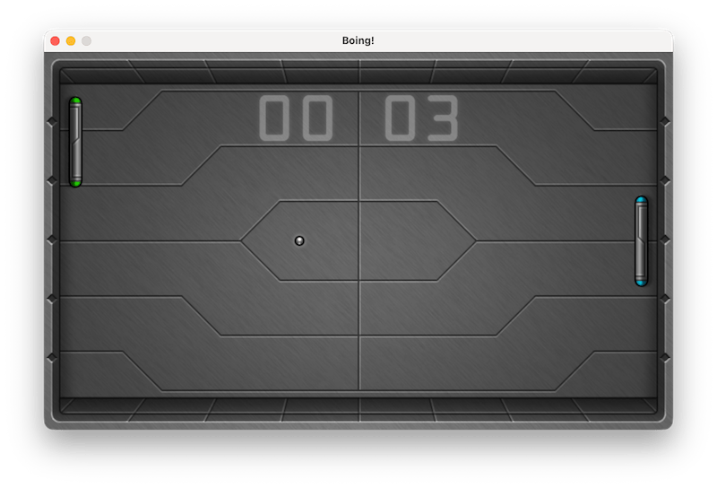

# Boing!

Boing! is a fast-paced table-tennis arcade game. Defend your side of the table, return the ball, and be the first
player to score 10 points.



## Features

- Single-player mode against a computer-controlled opponent
- Local two-player mode
- Keyboard and joystick controls
- Increasing ball speed during each rally
- Animated impact effects, sound effects, and music
- Fullscreen mode

## Controls

| Action | Player 1 | Player 2 |
| --- | --- | --- |
| Move up | A | Up Arrow |
| Move down | Z | Down Arrow |

Joysticks are also supported for up to two players. At the title screen, use Up/Down to select one or two players,
then press Space or the controller's primary button to start. During a game, press Enter to pause and Escape to
return to the title screen; press Escape from the title screen to quit.

In single-player mode, the Up and Down arrows can also control Player 1.

## Run

Boing! requires [uv](https://docs.astral.sh/uv/) (Python package and project manager) to be installed.

Run the game with uv (all dependencies will be installed automatically on the first launch):

```sh
uv run main.py
```

The game starts in fullscreen mode. Run `uv run main.py --debug` for a windowed display.

## Credits

Boing! is based on the original work from the [Code the Classics II](https://store.rpipress.cc/products/code-the-classics-volume-ii) book and was improved by
Alexey "SibProgrammer" Yuzhakov.
